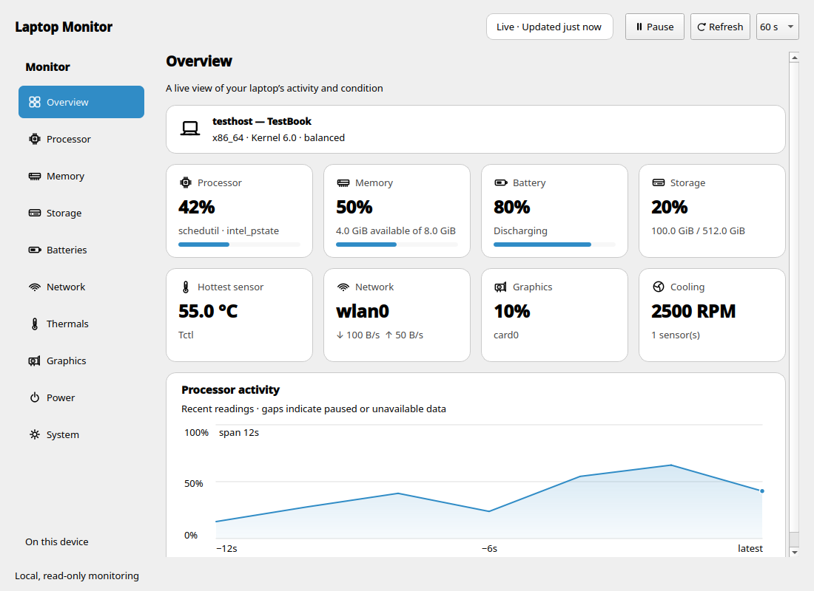

# Laptop Monitor

A read-only Linux laptop monitor with a native Qt desktop app, a terminal dashboard,
and JSON diagnostics. The project keeps the `thinkpad-monitor` command and package
name for existing users, while discovering hardware by capability rather than brand.



Synthetic preview. The interface follows your system theme and font, with
adaptive navigation, clear metric cards and a timestamped activity chart.
See the [dark preview](docs/desktop-preview-dark.png) and
[compact enlarged-text preview](docs/desktop-preview-narrow-large.png).

Monitor CPU and individual cores, memory and swap, root filesystem and disk activity,
all network interfaces, multiple batteries, thermal sensors, fans, graphics devices,
and available measured power domains. Missing sensors are shown as **Unavailable**;
a stopped fan or a real zero reading stays zero. Nothing changes fan settings,
charge thresholds, firmware, power profiles, or system services.

## Install

Desktop: Python **3.10+**, Linux **x86-64 or ARM64**, and a working Wayland or X11
session. The base terminal/JSON package requires Python 3.9+ and psutil. Other Linux
architectures can use the base package if psutil and curses are available; desktop
support depends on a compatible distribution PySide6 build. Pip desktop wheels
require a compatible glibc distribution; they are not universal musl/Alpine binaries.

From this checkout, install into a dedicated user-local environment and add a
**Laptop Monitor** applications-menu shortcut:

```bash
./install.sh
```

This needs Python's `venv` and pip support. It downloads declared dependencies and
does not run sudo, install OS packages, or modify system Python. On Debian/Ubuntu,
install your distribution's `python3-venv` package first if venv is unavailable.
If Qt reports a missing platform library, install the matching Qt Wayland/X11
runtime dependencies from your distribution. Desktop libraries must match the
session and architecture.

If your distribution already supplies PySide6 and psutil for your Python version:

```bash
./install.sh --system-site-packages
```

Terminal-only installation avoids Qt:

```bash
./install.sh --tui
```

For pipx users:

```bash
pipx install '.[desktop]'
thinkpad-monitor --desktop
```

Pipx creates the commands; `./install.sh` also registers the applications menu and
icon. The installer honors `XDG_DATA_HOME`, defaulting to `~/.local/share`, and puts
the command in `~/.local/bin`. Add that directory to your PATH if needed. To remove
a user-local installation, remove its `thinkpad-monitor` app directory, launcher,
`applications/thinkpad-monitor.desktop`, and
`icons/hicolor/scalable/apps/thinkpad-monitor.svg` within those same locations.

## Run

```bash
thinkpad-monitor                 # desktop in graphical sessions, terminal otherwise
thinkpad-monitor --desktop       # native desktop
thinkpad-monitor --tui           # generic terminal dashboard
thinkpad-monitor --json          # snapshot; no Qt/display required
thinkpad-monitor --interval 5    # refresh every five seconds
thinkpad-monitor --version
```

The desktop offers refresh, pause/resume, a remembered refresh interval, a bounded CPU history
plot, and filterable detail pages for batteries, networks, graphics and sensors. It uses your
Qt theme, scrollable content and ordinary windows; collection runs in a background
worker. It does not depend on a tray extension or a particular desktop shell.

Use **Ctrl+R** to refresh, **Ctrl+P** to pause or resume, **Ctrl+F** to filter the
current detail page, **Ctrl+C** to copy table rows, and **Alt+Left/Right** to change
pages. An explicit `--interval` overrides the saved desktop setting.

The terminal supports **q** to quit, **Space** to pause, and **↑/↓** to scroll.
`--legacy-tui` retains the original specialist ThinkPad/AMD terminal dashboard;
it is separate from the generic capability-aware views.

## Compatibility and limits

| Component | Support strategy | Validation |
| --- | --- | --- |
| GNOME, KDE Plasma, Xfce, Cinnamon, MATE, LXQt | Qt Widgets with freedesktop menu entry; Wayland/X11 backend chosen by Qt | Local KDE runtime checks; other desktops need release testing |
| Intel, AMD, ARM CPUs | psutil, dynamic cores/cpufreq discovery; no x86-specific instructions | Live Intel x86-64 and fixture tests; ARM64 CI configured |
| Lenovo, Dell, HP, ASUS, Acer and other laptop brands | Kernel power_supply, hwmon, thermal, DRM capability discovery | Arbitrary names/multiple batteries and missing sensor fixtures; no claim of testing every brand |
| AMD, Intel, NVIDIA and other GPUs | Enumerate DRM cards and driver/vendor; read metrics actually exposed | Intel live discovery; AMD/Intel/NVIDIA/generic fixtures |
| Battery power/health | Energy or charge-based packs; fixed units, independent health fields | Multi-pack fixtures and local battery |
| CPU/GPU power | Measured hwmon readings and readable RAPL energy deltas | RAPL wraparound fixtures; restricted files stay unavailable |

Not every laptop exports fan RPM, battery cycles, temperatures, GPU load or CPU
power. Intel and proprietary NVIDIA drivers commonly do not expose AMD's load/VRAM
files; GPU discovery works but those fields can be unavailable. No privileged
`nvidia-smi`, `intel_gpu_top`, EC probing or root daemon is required. RAPL permissions
are left as configured by the system. Battery time and charge-to-energy conversions
are estimates; design voltage is preferred where available. The first counter
sample establishes a baseline, so rates settle on the next refresh. Network totals
are kernel interface counters; disk activity is system-wide, filesystem capacity
is for `/`.

## Development and checks

```bash
python3 -m venv --system-site-packages .venv
.venv/bin/python -m pip install '.[desktop]'
.venv/bin/python -m unittest discover -s tests -v
QT_QPA_PLATFORM=offscreen .venv/bin/python -m thinkpad_monitor --smoke-test
.venv/bin/python -m thinkpad_monitor --screenshot docs/desktop-preview.png
.venv/bin/python -m thinkpad_monitor --json
```

Tests inject fake sysfs/procfs, clocks and psutil so missing hardware, permissions,
multi-battery systems, hotplug, resets and RAPL wrapping can be tested without root.
The GUI smoke test checks collection and rendering; it does not prove every
compositor or physical architecture. See [validation](docs/VALIDATION.md) and
[design and sources](docs/DESIGN.md) for evidence and remaining release checks.

CI runs desktop offscreen tests on x86-64 and ARM64 runners. Release configuration
builds architecture-labelled directory bundles with checksums and Python source/wheel
packages. These workflows must run remotely before release artifacts are considered
validated. The former single unnamed Linux binary was x86-only; new bundles include
Qt and still need compatible host graphics libraries and glibc (Ubuntu 22.04 base
for x86-64; Ubuntu 24.04 base for ARM64). Source installation is the portable path.

[MIT license](LICENSE). Qt/PySide6 has its own license terms, which apply when
redistributing desktop bundles; retain the bundled notices and library files.
